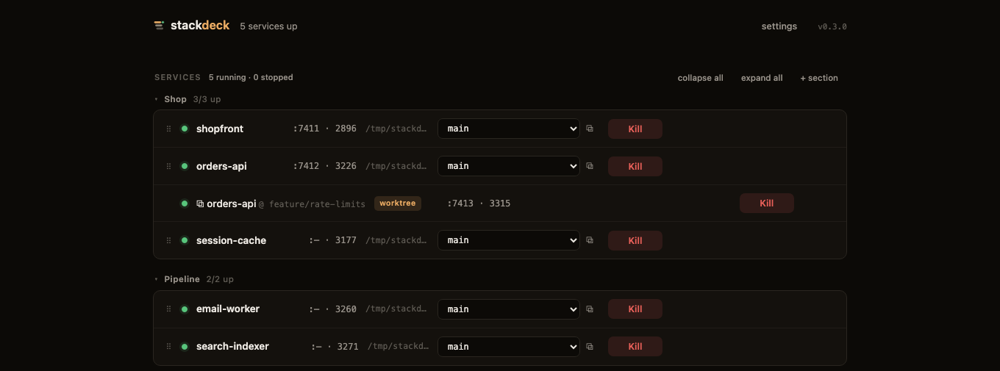

**Your projects folder, as a control panel.**



*(Fictional demo data — spin it up yourself with `./scripts/demo.sh`.)*

A browser dashboard for the services you run every day in local development.
Stackdeck scans your projects folder, figures out how to run each repo, and
gives you Start / Kill / restart buttons, live logs, and a **git branch
dropdown** that checks out the branch before launching. Zero dependencies —
one Node process, one HTML page, binds to 127.0.0.1.

*Spiritual successor to [hotel](https://github.com/typicode/hotel)
(unmaintained since 2019), with the git-awareness of
[portree](https://github.com/fairy-pitta/portree) and the multi-project scope
neither has.*

## Quick start

```bash
git clone https://github.com/beingmechon/stackdeck && cd stackdeck
node bin/stackdeck.js         # starts the daemon, opens http://localhost:8899
```

Or link it onto your PATH:

```bash
npm link                     # then: stackdeck | stackdeck status | stackdeck logs api
```

## What it does

- **Discovers your projects** — scans your project roots (default `~/Projects`),
  detects git repos + current branch, and infers a run command per repo
  (pnpm/npm/yarn scripts, Makefile targets, Python entrypoints with uv
  detection, docker-compose, cargo, go).
- **Services** — a project you've promoted to a runnable recipe: directory +
  command + port + env. Start / Kill / restart from the browser or CLI, live
  ANSI-colored logs (also on disk), status by pid *and* port — services
  started outside Stackdeck show as `external` and can be killed too.
  Killing the daemon never kills your services: pids persist to disk and a
  restarted daemon re-adopts them (still killable, logs resume on restart).
- **Git-aware** — a branch dropdown per service; picking a branch runs
  `git checkout` before start, refused while the tree is dirty. Dirty repos
  are badged.
- **Organize the board** — drag rows between your own sections, per-section
  *start all* / *stop all*, collapse/expand, hide/unhide anything, categorize
  the project list.
- **Stacks that start in order** — give a service `dependsOn` and it starts
  after its dependencies are *ready* (a log-line regex via `readyWhen`, an
  HTTP check, or its port opening). Section **start all** is
  dependency-ordered; cycles fail loudly.
- **Crash handling** — `restart: on-failure` restarts with exponential
  backoff (5 tries, resets after a minute of clean uptime); unexpected exits
  show a `crashed` badge and fire a browser notification. Manual stops never
  auto-restart.
- **Port squatter eviction** — if another process holds a service's port,
  Start tells you the pid and offers to kill it and take the port.
- ***.localhost domains** — a built-in reverse proxy maps
  `<service>.localhost` → its port (WebSockets included). Browsers resolve
  `*.localhost` natively: no /etc/hosts, no PAC files. Port 80 where the OS
  allows unprivileged bind (macOS), `:8880` otherwise.
- **Multi-process repos** — a Procfile, docker-compose services, or pnpm
  workspace packages turn one repo into a section of services with one click.
- **Parallel branches (worktrees)** — pick a branch and hit ⧉: the service
  runs that branch in its own git worktree with a free port injected as
  `$PORT`, side by side with the main checkout. Made for the
  several-agents-on-several-branches workflow. Instances are ephemeral (they
  don't survive daemon restarts) and worktrees are reused across runs.
- **CLI parity** — `stackdeck status|start|stop|restart|logs <name>` talks to
  the same daemon.
- **MCP server** — `stackdeck mcp` exposes list/start/stop/restart/logs as
  MCP tools over stdio, so AI coding agents can manage (and debug against)
  your dev environment. Zero-dependency, wraps the same authenticated API.
- **Dev tools** — detects databases and brokers installed on your machine
  (PostgreSQL, MySQL/MariaDB, MongoDB, Redis/Valkey, Elasticsearch/OpenSearch,
  RabbitMQ, NATS, MinIO, Temporal, ClickHouse, Mailpit, Memcached) and
  one-click configures them as ordinary foreground services — managed child,
  streamed logs, clean kill. Data directories are resolved from standard
  locations (or self-initialized under `~/.local/share/stackdeck/`); no Docker,
  no launchd/systemd indirection.

## Configuration

Everything lives in one JSON file — `~/.config/stackdeck/config.json`
(or `$STACKDECK_HOME/config.json`); logs sit next to it. Every field is
editable from the UI; the interesting ones:

```jsonc
{
  "port": 8899,
  "projectRoots": ["~/Projects", "~/work"],   // folders to scan
  "categoryOrder": ["Products", "Tools"],     // display order of project categories
  "projectCategories": { "my-repo": "Products" },
  "groups": ["Stack A"],                      // your service sections
  "services": [
    {
      "name": "api",
      "dir": "~/Projects/my-app",
      "command": "pnpm run dev",
      "port": 3001,                            // for status detection + <name>.localhost
      "env": { "DEBUG": "1" },
      "group": "Stack A",
      "dependsOn": ["db"],                     // started (and ready) first
      "readyWhen": { "log": "Listening on" },  // or { "http": "http://…/health" }; default: port opens
      "restart": "on-failure"                  // exponential backoff, 5 tries
    }
  ]
}
```

## Security model

The daemon executes shell commands by design, and **localhost is not a
security boundary** — so the API is gated by a per-install secret
(`<state dir>/secret`, mode 0600). The web page receives the token by being
served from disk by the daemon itself; the CLI reads it as the same user.
Every `/api/*` call without it gets a 401 (only the bare `/api/ping`
liveness check is open). State files are 0600 in a 0700 directory.

Layered on top: the daemon binds to 127.0.0.1 only, pins the `Host` header
(DNS-rebinding defense), accepts only `application/json` POSTs (a cross-origin
JSON POST forces a CORS preflight, which is never answered; `text/plain`
sneak-POSTs are rejected), rejects foreign `Origin` headers, validates
service/section names, ports, dirs, and env server-side, limits request bodies
to 1MB, and restricts the folder browser to your home directory and configured
roots. Config writes are atomic; a corrupt config is set aside, never fatal.
Logs rotate at 5MB per service. Do not port-forward the daemon off your machine.

The `*.localhost` proxy is unauthenticated by design (your browser needs it),
but it only forwards to the loopback ports of services you configured —
nothing else is reachable through it. Note that it makes those services
reachable at *guessable names* from any site you visit (same-origin policy
still blocks reading responses); that's roughly the exposure a guessable
port already had, but if a dev service has destructive unauthenticated
endpoints, don't give it a port in Stackdeck.

Stackdeck is **Unix-only** (macOS/Linux): it relies on bash, process groups,
and lsof/ss. The `.env` loader is intentionally minimal — flat `KEY=value`
lines, quotes and `#` comments handled, no interpolation or multiline values.

## Notes that will save you a debugging session

- Services spawn through a **non-login** shell with the PATH of your login
  shell resolved once at daemon start — so nvm/homebrew/uv tools are found
  even when the daemon was launched from a GUI, and profile files can't
  reorder your toolchain per-spawn.
- The HTTP server accepts headers up to 256KB, because browsers hoard
  localhost cookies across every dev app you've ever run, and Node's 16KB
  default silently breaks localhost apps (431s / dropped connections).
- Kill stops the whole process group; stragglers get SIGKILL after 5s.

## macOS app (optional)

```bash
./scripts/macos-app.sh    # builds ~/Applications/Stackdeck.app from this checkout
```

Double-click to start the daemon and open the board. Linux users: `stackdeck`
in a terminal, or add a systemd user unit for `node server.js`.

## Status

Early. Solid daily driver, small codebase (~1 file each side), no tests yet.
Issues and PRs welcome.

## License

MIT
