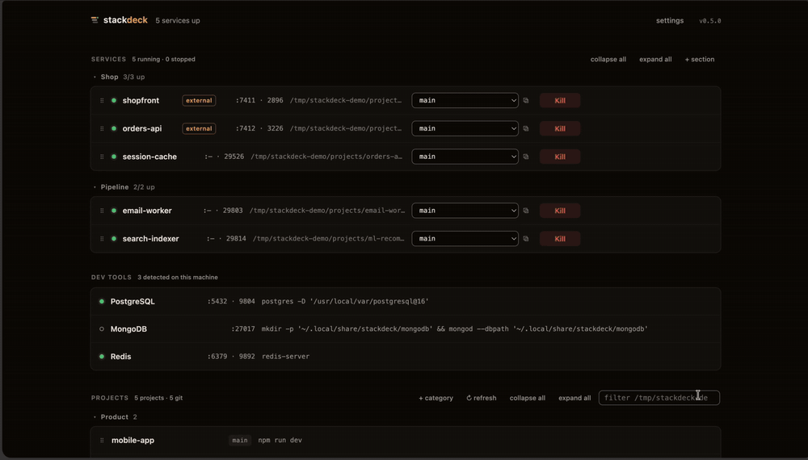

**Your projects folder, as a control panel.**



Stackdeck finds the projects in your folders, works out how to run each one,
and puts them on a board: Start, Kill, live logs, and a branch dropdown.
One Node process, one HTML page, no dependencies, bound to 127.0.0.1, and it
never talks to the internet.

*Spiritual successor to [hotel](https://github.com/typicode/hotel)
(unmaintained since 2019), with the git-awareness it never had.*

## Quick start

```bash
npx stackdeck        # starts the daemon, opens http://localhost:8899
```

Point it at your projects folder in settings, then press **configure** on any
project to put it on the board. `npm i -g stackdeck` if you want the CLI on
your PATH.

## The three things it does that other process managers don't

**Run a branch, not just a repo.** Every service has a branch dropdown: pick
one and Start checks it out first. Or hit ⧉ and that branch runs in its own
git worktree, alongside your main checkout, with a free port and the main
copy's `.env`. If a coding agent already made a worktree for the branch,
Stackdeck runs that one instead of fighting git over it.

**Visit it and it starts.** Turn on *start on demand* and opening
`api.localhost` boots the service and holds the request until it's ready.
With *idle stop*, it shuts down again once nothing has hit it for a while —
so twenty configured services cost nothing until you open one.

**Your whole projects folder, not one Procfile.** It scans your roots, detects
git repos, and infers a run command per project across ~15 ecosystems
(Makefile and just targets, npm/pnpm/yarn/bun scripts, Python with
uv/poetry/pipenv, cargo, go, gradle, mix, compose, and more). A monorepo with
several apps becomes a section of services in one click.

## It never talks to the internet

No telemetry, no analytics, no update checks, no accounts, no CDN. The page
loads no external fonts, scripts, or images — the icon and logo are inline.
The daemon listens on 127.0.0.1 and the only connections it opens are to
loopback ports of services you configured. Nothing you do here leaves the
machine, and it all works on a plane.

Verify it yourself in one command while it's running:

```bash
lsof -nP -a -p "$(pgrep -f 'stackdeck|server.js' | head -1)" -i
# only 127.0.0.1:<port> (LISTEN), plus loopback connections to your services
```

The single exception is a URL you type: `readyWhen: { "http": "…" }` fetches
exactly that address to decide when a service is ready. Point it at your own
service (it normally is `http://localhost:…`) and there is nothing else.

## Everything else

- **Sections you arrange** — drag services (or move them by keyboard) into
  your own groups, with *start all* / *stop all*, collapse, and hide.
- **Stacks that start in order** — `dependsOn` waits for each dependency to be
  *ready*: a log-line regex, an HTTP check, or its port opening.
- **Honest status** — running state comes from pid *and* port. Services you
  started elsewhere show as `external`. Killing something a supervisor
  restarts says so instead of pretending. Killing the daemon leaves your
  services running; a restarted daemon re-adopts them.
- **Crash handling** — `restart: on-failure` backs off exponentially, and
  unexpected exits get a badge and a browser notification.
- ***.localhost domains** — a built-in reverse proxy, WebSockets included, so
  `api.localhost` beats remembering ports. Browsers resolve `*.localhost`
  natively: no /etc/hosts, no PAC file.
- **Port conflicts, handled** — if something else holds the port, Start names
  the pid and offers to evict it.
- **Databases without Docker** — detects Postgres, MySQL, MongoDB, Redis,
  Elasticsearch, RabbitMQ, NATS, MinIO, Temporal, ClickHouse and friends on
  your machine, and runs them as ordinary services with streamed logs.
- **CLI and MCP** — `stackdeck status|start|stop|restart|logs <name>`, plus
  `stackdeck mcp` so coding agents can drive your dev environment themselves.
- **Themes** — calm, playful, austere, or a custom one you build from a few
  sliders in settings (a full light theme is one drag).

Keyboard-operable throughout, WCAG AA contrast, respects reduced motion.

<details>
<summary><b>Configuration</b> — one JSON file, all of it editable from the UI</summary>

Everything lives in `~/.config/stackdeck/config.json` (or
`$STACKDECK_HOME/config.json`); logs sit next to it.

```jsonc
{
  "port": 8899,
  "projectRoots": ["~/Projects", "~/work"],   // folders to scan
  "categoryOrder": ["Products", "Tools"],     // order of project categories
  "groups": ["Stack A"],                      // your service sections
  "theme": "playful",                         // or austere / custom
  "services": [
    {
      "name": "api",
      "dir": "~/Projects/my-app",
      "command": "pnpm run dev",
      "port": 3001,                            // status detection + api.localhost
      "env": { "DEBUG": "1" },
      "group": "Stack A",
      "dependsOn": ["db"],                     // started (and ready) first
      "readyWhen": { "log": "Listening on" },  // or { "http": "…" }; default: port opens
      "restart": "on-failure",                 // exponential backoff, 5 tries
      "onDemand": true,                        // boot it when api.localhost is visited
      "idleAfter": 30                          // stop it again after 30 idle minutes
    }
  ]
}
```
</details>

<details>
<summary><b>Security model</b> — it runs shell commands, so this matters</summary>

Nothing leaves your machine (see [above](#it-never-talks-to-the-internet)) —
but the daemon runs shell commands on it, so the local surface matters.

**localhost is not a security boundary**, so the API is gated by a per-install
secret (`<state dir>/secret`, mode 0600). The page gets the token by being
served from disk by the daemon; the CLI reads it as the same user. Every
`/api/*` call without it gets a 401 — only `/api/ping` is open. State files
are 0600 in a 0700 directory.

Layered on top: binds 127.0.0.1 only, pins the `Host` header (DNS-rebinding
defense), accepts only `application/json` POSTs (a cross-origin JSON POST
forces a preflight that is never answered; `text/plain` sneak-POSTs are
rejected), rejects foreign `Origin` headers, validates names, ports, dirs and
env server-side, caps bodies at 1MB, and limits the folder browser to your
home and configured roots. Config writes are atomic; a corrupt config is set
aside, never fatal. **Do not port-forward the daemon off your machine.**

The `*.localhost` proxy is unauthenticated by design — your browser needs it —
and forwards only to ports of services you configured. It does make those
reachable at guessable names from any site you visit (same-origin still blocks
reading responses), which is roughly the exposure a guessable port already had.
That is also why *start on demand* is opt-in per service: with it on, any page
you visit could start that service.
</details>

<details>
<summary><b>Notes that will save you a debugging session</b></summary>

- Services spawn through a **non-login** shell using the PATH of your login
  shell, resolved once at daemon start — so nvm/homebrew/uv tools are found
  even when the daemon was launched from the GUI.
- **A service that logs "Ready" but shows "this page isn't working"** is
  almost always the localhost cookie jar: browsers hoard cookies for
  `localhost` across every dev app you've run, and Node's 16KB header limit
  rejects the request before your code sees it (`curl` succeeds because it
  sends no cookies). Set `{"NODE_OPTIONS": "--max-http-header-size=131072"}`
  in the service's env, or clear cookies for localhost.
- **`$PORT` is a request, not a guarantee.** Vite reads `vite.config`, Next
  reads `-p`. If a worktree instance ignores the port Stackdeck injects, the
  board tells you where it actually bound. Make it obey with
  `--port ${PORT:-5173}` (Vite) or `-p ${PORT:-3000}` (Next) in the command.
- Kill stops the whole process group; stragglers get SIGKILL after 5s.
- **Unix only** (bash, process groups, lsof/ss). The `.env` loader is
  deliberately minimal: flat `KEY=value`, quotes and `#` comments, no
  interpolation.
</details>

<details>
<summary><b>macOS app</b> — optional double-click launcher</summary>

```bash
./scripts/macos-app.sh    # builds ~/Applications/Stackdeck.app from this checkout
```

Linux: run `stackdeck`, or add a systemd user unit for `node server.js`.
</details>

## Status

Early, but a solid daily driver — two files you can read in an evening, which
is the point for something that runs shell commands. No tests yet. Issues and
PRs welcome.

## License

MIT
